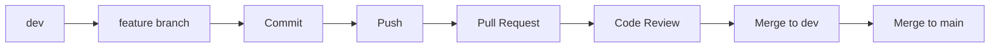

# 📊 FinLens-RAG: Financial Document Intelligence Assistant

> An advanced RAG system for analyzing financial documents such as 10-K, 10-Q reports, prospectuses, and contracts using Hybrid Retrieval, Agentic RAG, and Evaluation Frameworks.

---

## 📁 Project Structure

```text
financial-rag-assistant/
│
├── .github/
│   └── workflows/
│       ├── ci.yml
│       └── cd.yml
│
├── data/
│   ├── raw/
│   ├── processed/
│   └── evaluation/
│
├── notebooks/
│   ├── 01_eda_and_parsing.ipynb
│   ├── 02_hybrid_search_experiments.ipynb
│   └── 03_ragas_evaluation.ipynb
│
├── src/
│   ├── parser/
│   ├── indexer/
│   ├── retrieval/
│   ├── pipeline/
│   ├── evaluation/
│   ├── backend/
│   └── frontend/
│
├── tests/
│
├── Dockerfile
├── docker-compose.yml
├── README.md
└── requirements.txt
```

---

# 🏗️ System Architecture

## 📄 Parser Module (Member A)

Responsible for extracting and normalizing financial documents.

| File | Description |
|------|-------------|
| `doc_parser.py` | Extract text and tables using Docling/LlamaParse |
| `normalizer.py` | Normalize tables into Markdown/JSON |

---

## 🔍 Indexing Module (Member B)

Responsible for chunking, embedding, and vector storage.

| File | Description |
|------|-------------|
| `chunker.py` | Hierarchical Parent-Child chunking |
| `embedder.py` | Dense embedding configuration |
| `vector_db.py` | Qdrant/Pinecone schema & metadata filtering |

---

## 🧠 Retrieval Module (Member B)

Responsible for advanced retrieval strategies.

| File | Description |
|------|-------------|
| `hybrid_search.py` | BM25 + Dense Retrieval |
| `reranker.py` | BGE/Cohere reranking |

---

## 🤖 RAG Pipeline (Member C)

Core orchestration and agent system.

| File | Description |
|------|-------------|
| `router.py` | Agentic query routing |
| `tools.py` | Financial calculators |
| `chain.py` | LangChain/LangGraph pipeline |
| `citation.py` | Dynamic citation generation |

---

## 📈 Evaluation & Guardrails (Member D)

Evaluation framework and safety layer.

| File | Description |
|------|-------------|
| `ragas_eval.py` | RAGAS benchmarking |
| `guardrails.py` | Hallucination prevention |

---

## ⚙️ Backend & Deployment (Member E)

API services and deployment infrastructure.

| File | Description |
|------|-------------|
| `main.py` | FastAPI entrypoint |
| `config.py` | Environment configuration |
| `cache.py` | Redis semantic cache |
| `api/endpoints.py` | REST API endpoints |

---

## 🖥️ Frontend (Member E)

User interaction layer.

| File | Description |
|------|-------------|
| `app.py` | Streamlit/React interface |

---

# 👥 Team Responsibilities

| Member | Role | Main Responsibilities |
|--------|------|----------------------|
| A | Data & Domain Lead | Data collection, parsing |
| B | Retrieval Engineer | Chunking, embeddings, retrieval |
| C | RAG Pipeline Engineer | Agentic RAG pipeline |
| D | Evaluation & QA Engineer | Evaluation, guardrails |
| E | Backend & Deployment Engineer | API, frontend, CI/CD |

---

# 🌿 Git Workflow

## Core Branches

| Branch | Purpose |
|---------|---------|
| `main` | Stable production branch |
| `dev` | Integration branch |

---

## Feature Branch Naming

```bash
[type]/[member]-[task]
```

Examples:

```bash
feature/A-pdf-table-parsing
feature/B-hybrid-search-rerank
feature/C-core-rag-pipeline
feature/D-ragas-benchmarking
feature/E-fastapi-backend
```

---

# 🔄 Development Workflow



---

# 🛠️ Git Cheatsheet

### 1. Create a Feature Branch

```bash
git checkout dev
git pull origin dev
git checkout -b feature/A-pdf-table-parsing
```

### 2. Commit Changes

```bash
git status
git add .
git commit -m "feat(parser): integrate docling pdf parser"
```

### 3. Push to GitHub

```bash
git push -u origin feature/A-pdf-table-parsing
```

### 4. Create Pull Request

- Open GitHub Repository
- Click **Compare & Pull Request**
- Set:

```
base: dev
compare: feature/A-pdf-table-parsing
```

- Assign reviewers
- Submit PR

### 5. Cleanup

```bash
git checkout dev
git pull origin dev
git branch -d feature/A-pdf-table-parsing
```